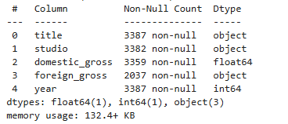
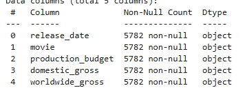

<h2><b>FILM_BOX_ANALYSIS</b></h2>

<h2>1.0Projet overview</h2>

Our project is to analyze current box office trends and competitor strategies to provide actionable insights for the company’s new movie studio..

<h2>1.1.Methodology</h2>

Some of the analytical means used are through the correlation of the variables 
Drawing of the trend lines to tell us the next expectations Plotting of the bar graphs to the relationships of the gross income

<h2>2.0.Business Understanding</h2>

This project explores patterns in box office performance to help a new movie studio understand what types of films are currently performing best. 
The insights derived from this analysis are intended to guide strategic decisions in film production, focusing on genres, budgets, and other key factors influencing success.

<h2><b>3.0.Business Objectives</b></h2>

As more companies venture into original video content, this analysis supports our company's entry into the industry by identifying 
i) What genres are performing best 
ii) Optimal budget ranges for profitability 
iii) Key trends in studio success and distribution 
iv) Factors that influence domestic and international gross

<h2>3.1.Stake holders</h2>

  <b>i)Project sponsor:</b> Champions the project and ensure it alligns with company goals 
<b>ii)Project Sponsor:</b> Responsible for planning, executing and delivering the project 
<b>iii)Box film Customers:</b> Impacted by project outcomes, such us the new movies 
<b>iv)Box movie Operation Teams:</b> they are impacted with the project outcomes and the make of the Box film 
<b>v)Finance and accounting Team:</b> Responsible for managing project budget and financial reporting

<h2>4.0 Data Understanding</h2>

<b>Data source:</b>
The files we will use in the analysis are in different formats, some in CSV, TSV, and a database file.  We obtained our data from a GitHub account,which you can <a href="https://github.com/learn-co-curriculum/dsc-phase-2-project-v3">Visit by clicking</a>

<h3>4.1Data Structure</h3>

Understanding the data structure, we will check at the data types from our data 

 
